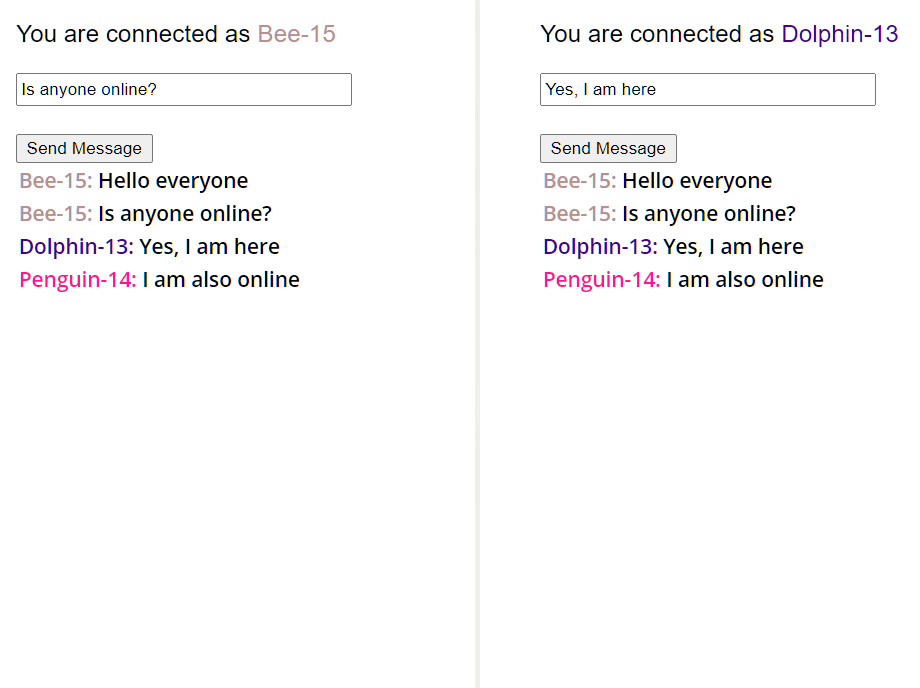

# Chat Application with Server Sent Events (SSE) in spring boot

- Start `SseDemoApplication`
- Open https://localhost:8443 in multiple browser windows
- Ignore the SSL warning
- Use the chat

## Preview

## Hint for parallel connections

The browser allows only 6 parallel connections for an SSE. 
After some investigation I found out, this is solved in HTTP/2 with a connection pool.
But in order to enforce HTTP/2 one must also use SSL. Therefore I enabled SSL by default for the demo.